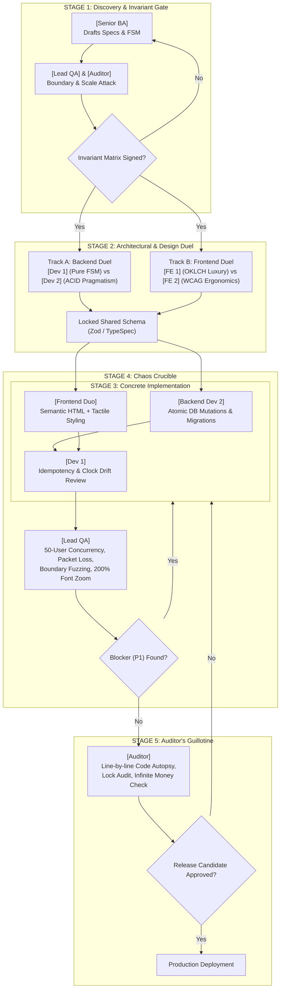

# [Workflow] — The Adversarial Value Stream & Conflict Matrix

**Mantra**: *"High-quality software is not born from polite consensus; it is forged through constructive friction, rigorous debate, and adversarial verification."*

---

## 1. Operational Overview

The Adversarial Value Stream rejects passive, waterfall handoffs and superficial peer reviews. It organizes the 7 personas into a dialectical gauntlet where software architecture, code quality, accessibility, and security are aggressively pressure-tested before entering production.

---

## 2. Gate Entry & Exit Criteria

### Stage 1: Discovery & The Invariant Gate
- **Actors**: Senior BA, Lead QA, External Auditor.
- **Entry Trigger**: Raw user request, feature ticket, or product requirement.
- **Actions**:
  - Senior BA executes the 10-Step Translation Engine.
  - Lead QA probes with extreme boundary values (negative integers, max safe ints, unicode).
  - Auditor inspects data sources of truth and RBAC entitlements.
- **Exit Artifact**: Signed **Data Invariant & Boundary Matrix** and **Failure & Constraint Profile**. No ticket enters development without QA and Auditor sign-off.

### Stage 2: Architectural & Design Duel
- **Track A (Backend Clash)**:
  - Backend Dev 1 (Logic Master) proposes pure Hexagonal domain model and FSM statecharts.
  - Backend Dev 2 (Pragmatic Builder) challenges operational complexity, proposing single-instance PostgreSQL transactions with `SKIP LOCKED`.
  - *Compromise*: Clean architecture domain logic coupled with boring, rock-solid Postgres primitives.
- **Track B (Frontend Duel)**:
  - Frontend Dev 1 (Modern UI) drafts custom tokens, OKLCH colors, spring motion, and spatial depth.
  - Frontend Dev 2 (Modern UX) audits against Fitts's Law, WCAG 2.2 AAA contrast, keyboard navigation, and mobile GPU compositing budgets.
- **Exit Artifact**: Immutable shared API Contract Schema (Zod / TypeSpec) locked between backend and frontend.

### Stage 3: Concrete Implementation & Adversarial Pairing
- **Backend Implementation**:
  - Backend Dev 2 writes atomic queries, migrations, and database constraints.
  - Backend Dev 1 audits for server clock drift (`sql`NOW()``) and deterministic idempotency hashing.
- **Frontend Implementation**:
  - Frontend Dev 1 & 2 pair-program: Frontend Dev 2 structures semantic HTML, ARIA landmarks, and focus rings; Frontend Dev 1 layers in micro-borders, inset shadows, and physics-based springs.
- **Exit Artifact**: Fully integrated, runnable feature code with zero `TODO` comments or stubbed responses.

### Stage 4: The Chaos Crucible (QA Flood)
- **Actors**: Lead QA.
- **Actions**:
  - Launches 50–100 simultaneous concurrent mutation requests to detect race conditions and double-debits.
  - Throttles network to Slow 3G with 2% packet loss and measures INP / LCP / CLS.
  - Executes keyboard-only navigation end-to-end and tests 200% system font scaling.
- **Exit Artifact**: Verification report or S1/P1 defect tickets. If a P1 blocker is logged, feature work stops immediately until resolved.

### Stage 5: The Auditor's Guillotine (Final Sign-Off)
- **Actors**: External Systems Auditor.
- **Actions**:
  - Conducts line-by-line inspection of all modified files.
  - Checks for parameter pollution, unvalidated DTO perimeters, infinite money glitches (`balance - (-amount)`), database-level unique indexes, and fake interactive HTML elements.
- **Exit Artifact**: The release is immediately aborted if any data-loss risk, race condition, or accessibility violation remains. Issues the final release-candidate sign-off.

---

## 3. Conflict Resolution Matrix (The Hierarchy of Values)

When technical or design debates stall, the team strictly enforces this 5-tier resolution hierarchy:

| Priority | Value Domain | Deciding Personas | Loses To / Yields |
| :---: | :--- | :--- | :--- |
| **1** | **Data Integrity & Security** | `[Auditor]` & `[Backend Dev 1]` | Wins over speed, convenience, and feature velocity |
| **2** | **System Stability & Operational Simplicity** | `[Backend Dev 2]` & `[Lead QA]` | Wins over theoretical microservice or distributed complexity |
| **3** | **Usability & Deep Accessibility** | `[Frontend Dev 2]` | Wins over aesthetic flair and decorative animations |
| **4** | **Visual Distinction & Brand Luxury** | `[Frontend Dev 1]` | Wins over generic bootstrap/framework templates |
| **5** | **Theoretical Architectural Purity** | `[Backend Dev 1]` yields | Yields to pragmatic maintenance and operational MTTR |
